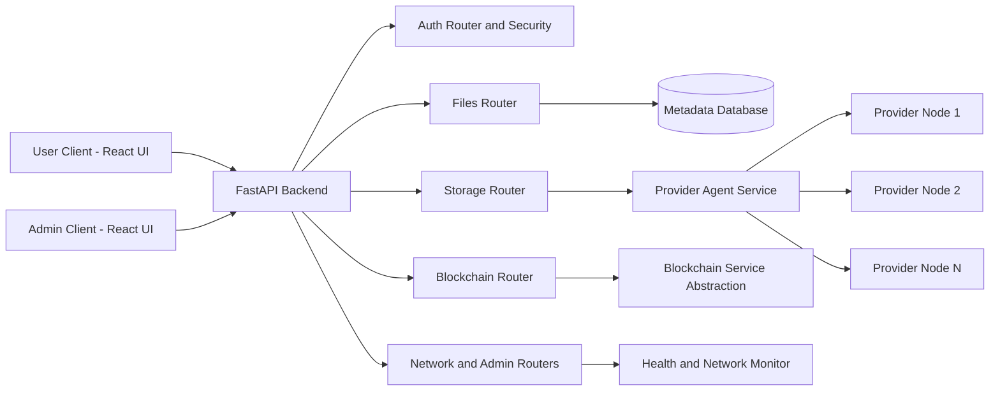
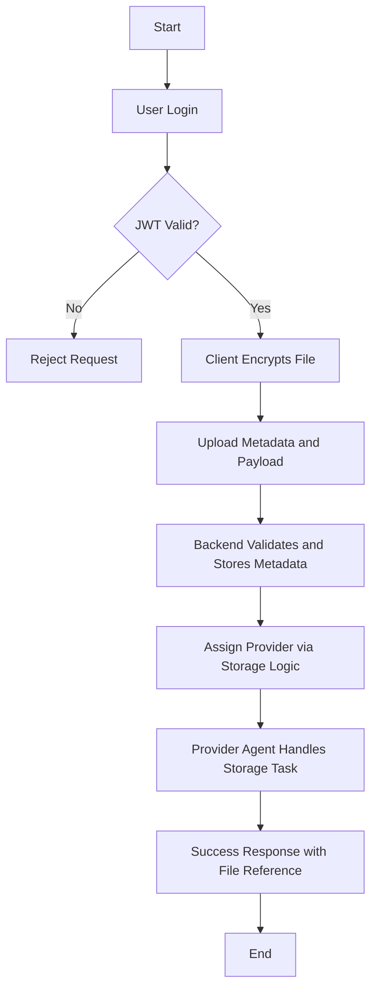
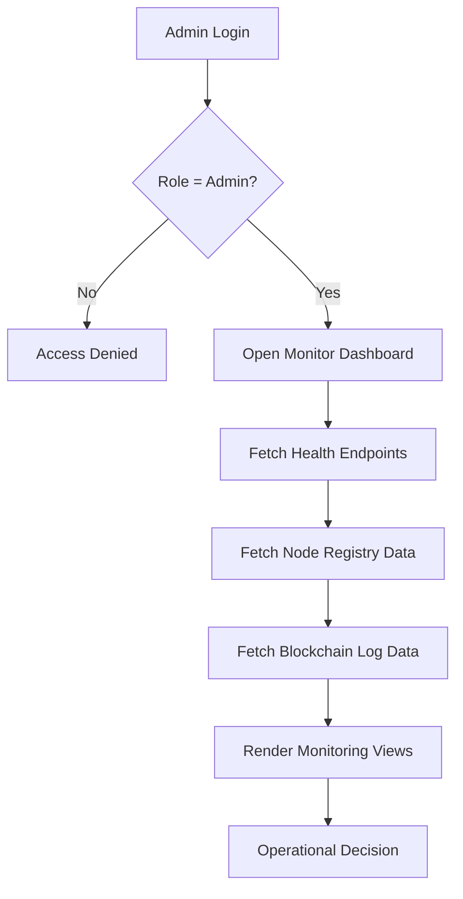

# DECENTRALIZED CLOUD STORAGE SYSTEM
## Comprehensive Project Report

### Student Project Report

- Project Title: Decentralized Cloud Storage System
- Project Duration: 21/02/2026 to 01/04/2026
- Report Date: 04/04/2026

---

## Formatting Compliance (STRICT)

This report content is prepared to be exported in the following final formatting standard:

- Font: Times New Roman
- Font Size: 12
- Line Spacing: 1.5
- Heading Style: Bold
- Margins: 1 inch (all sides)
- Alignment: Justified

Note: Markdown preview cannot guarantee final print formatting. Apply the above settings when converting this report into DOCX/PDF.

---

## Table of Contents

1. Abstract
2. Introduction
3. Literature Review
4. Methodology / System Design
5. Implementation
6. Results and Testing
7. Conclusion and Future Scope
8. References
9. Appendix

---

# 1. Abstract

Cloud storage has transformed the way data is created, shared, and managed. However, centralized cloud architectures create concerns around vendor lock-in, single points of failure, data sovereignty, and trust concentration. This project proposes and implements a Decentralized Cloud Storage System that combines modern web architecture with distributed service components, role-based governance, and secure file handling.

The system is composed of three major layers: a React-based frontend, a FastAPI backend, and a provider agent layer representing storage contributors. The backend orchestrates authentication, tokenized operations, file metadata management, blockchain-event support, and administrative governance. The frontend supports both user and admin roles with dedicated dashboards, secure upload workflows, monitoring pages, and wallet/token views. The provider agent layer is designed to support distributed storage behavior with health-aware participation and runtime isolation.

To improve practical deployment and reproducibility, the project includes containerized runtime support with Docker and docker-compose. This enables rapid environment setup and helps standardize development and testing workflows.

Testing and validation were carried out across authentication flows, role-protected APIs, upload and metadata pipelines, monitoring pages, and service health endpoints. The resulting platform demonstrates that a modular decentralized storage prototype can be built with production-oriented practices including API standardization, route security, deployment documentation, and maintainable component structure.

This work contributes an end-to-end, deployment-ready foundation for decentralized storage research and implementation in academic and prototyping contexts. The architecture is extensible for future integration of stronger consensus mechanisms, richer provider economics, and large-scale benchmarking.

---

# 2. Introduction

## 2.1 Background

Data has become a strategic asset in modern software ecosystems. Most enterprises and individuals rely on centralized cloud providers for reliability and convenience. While these systems deliver operational simplicity, they often constrain users through fixed policies, opaque infrastructure decisions, and dependency on a single service authority.

Decentralized storage addresses these concerns by distributing data responsibility across multiple nodes or providers. Such an approach can improve resilience, support data ownership expectations, and reduce concentration risks. However, building a practical decentralized storage platform involves multiple challenges including identity and access control, service orchestration, metadata integrity, provider coordination, and user experience consistency.

## 2.2 Problem Statement

Traditional cloud storage systems face several limitations:

- Single-point trust and control.
- Risk of service disruption due to centralized outage.
- Limited transparency in storage and retrieval mechanisms.
- Vendor dependency that may affect portability and cost.
- Weak user-level visibility into infrastructure behavior.

The project addresses these limitations by designing a decentralized cloud storage prototype with modular backend services, provider-aware routing logic, and role-governed operational interfaces.

## 2.3 Objectives

Primary objectives of this project are:

- Design a decentralized storage architecture with clear separation of concerns.
- Implement secure user authentication and role-based access controls.
- Build file and storage APIs with extensible metadata handling.
- Integrate provider agent communication and node registry capabilities.
- Implement blockchain-compatible service abstractions for auditable operations.
- Deliver a modern frontend for user and admin operations.
- Ensure containerized deployment and reproducible setup.
- Validate end-to-end workflows through testing and operational checks.

## 2.4 Scope

Included in scope:

- Multi-role frontend (public, user, admin).
- FastAPI backend with modular routers and services.
- Auth, admin, blockchain, storage, file, and network endpoints.
- Provider agent integration structure.
- Dockerized local deployment.
- Documentation and operational guides.

Outside current scope:

- Full production blockchain consensus implementation.
- Geo-distributed provider benchmarking at scale.
- Enterprise-grade compliance modules.
- Advanced incentive settlement engines.

## 2.5 Significance of the Project

This project serves as a practical bridge between conceptual decentralized systems and implementable full-stack software engineering. It demonstrates how decentralized principles can be integrated into a familiar web stack without sacrificing usability, maintainability, or deployment clarity.

The system is valuable for:

- Academic study of distributed storage architecture.
- Prototype-level decentralized application experimentation.
- Role-based operational dashboard design.
- Security-focused API and service design practices.

## 2.6 Report Organization

The rest of this report is organized as follows:

- Literature Review: Discusses foundational ideas and related decentralized storage approaches.
- Methodology / System Design: Describes architecture, data flow, and key design decisions.
- Implementation: Details backend, frontend, and deployment realization.
- Results and Testing: Presents functional validation and observed outcomes.
- Conclusion and Future Scope: Summarizes achievements and next-step improvements.
- References and Appendix: Provides sources and supplementary technical details.

---

# 3. Literature Review

## 3.1 Evolution of Cloud Storage

Cloud storage has evolved from managed data hosting to globally distributed, API-centric ecosystems. Centralized providers offer high availability and strong tooling but maintain operational authority over critical data paths. As concerns around privacy, control, and fault domains increased, distributed and decentralized alternatives gained traction.

## 3.2 Decentralization in Storage Systems

Decentralized storage systems aim to split trust and storage responsibility across independent entities. Core benefits generally include:

- Improved fault tolerance through distribution.
- Reduced central authority and lock-in.
- Potentially better data sovereignty options.
- Transparent protocols for storage participation.

However, decentralized systems can add complexity in node discovery, consistency, performance balancing, and user onboarding.

## 3.3 Blockchain-Adjacent Storage Models

Some modern decentralized platforms use blockchain components for integrity verification, transaction logging, or incentives. In many practical architectures, large file data is kept off-chain while metadata, commitments, or proofs are tracked in blockchain-compatible layers.

This project follows a similar practical direction by structuring blockchain services as modular abstractions rather than embedding heavy consensus logic directly into every operation.

## 3.4 Role of Provider Nodes

Provider nodes are a central concept in decentralized storage. They contribute storage capability and become part of the operational network. A robust system requires:

- Node registration and identity mechanisms.
- Health and availability tracking.
- Routing logic for storage assignments.
- Governance controls for trusted operations.

The implemented provider agent and network monitor components in this project support these requirements in a prototype-ready form.

## 3.5 Security Considerations in Distributed Storage

Key security considerations include:

- Authentication and authorization controls.
- Secure token handling across sessions.
- File encryption and integrity checks.
- Controlled admin operations and audit visibility.
- Service isolation in containerized deployments.

The project includes JWT-based authentication support, role-based route protection, frontend crypto utility support, and environment-based configuration practices.

## 3.6 Real-World Comparison

### 3.6.1 Comparison with Centralized Services

| Parameter | Centralized Cloud (e.g., Dropbox, Google Drive) | This Project Prototype |
|---|---|---|
| Control Model | Single provider authority | Distributed provider-oriented model |
| Trust Assumption | Provider-trust dominant | Shared trust with governance controls |
| Outage Risk | Higher impact from central outages | Potentially more resilient with node distribution |
| Transparency | Limited internal transparency | Observable service and network routes |
| Custom Governance | Limited by provider policy | Admin-governed platform controls |

### 3.6.2 Comparison with Decentralized Platforms

| Parameter | Filecoin / Storj (Mature Ecosystems) | This Project Prototype |
|---|---|---|
| Network Scale | Large global node ecosystems | Local/prototype environment |
| Incentive Mechanism | Advanced economic protocol | Token service abstraction (prototype-level) |
| Consensus Integration | Deep protocol integration | Blockchain service abstraction for extensibility |
| Developer Focus | Production-scale protocol usage | Full-stack educational and implementation focus |
| Deployment Simplicity | Higher learning curve | Dockerized quick local deployment |

## 3.7 Research Gap and Project Positioning

Many available examples either focus narrowly on blockchain protocol internals or provide only high-level architecture discussions without a complete full-stack implementation. This project addresses the gap by delivering:

- End-to-end frontend and backend implementation.
- Role-aware governance and operations.
- Provider-agent integration structure.
- Deployable local environment with documentation.

---

# 4. Methodology / System Design

## 4.1 Development Methodology

The project followed an incremental implementation methodology over 40 days:

- Planning and architecture definition.
- Backend core and route module implementation.
- Frontend module development with route segregation.
- Integration of storage, blockchain, and monitoring abstractions.
- Containerization and deployment hardening.
- Testing, regression fixes, and documentation finalization.

This approach reduced integration risk and enabled continuous validation.

## 4.2 High-Level Architecture Diagram (Mandatory)

## 4.3 Component Design

### 4.3.1 Frontend Layer

The frontend is implemented with React and organized into:

- Public pages for landing and onboarding.
- User pages for dashboard, upload, files, wallet, and storage.
- Admin pages for dashboard, registry, protocol settings, monitoring, and blockchain logs.
- Shared components for layout and theme controls.
- Context providers for authentication and theme state.

### 4.3.2 Backend Layer

The backend is built with FastAPI and modular routers:

- auth: registration and login.
- admin: privileged operations.
- files: file metadata workflows.
- storage: allocation and storage interactions.
- blockchain: transaction-compatible operations.
- network: node and network observations.
- health: operational heartbeat checks.

### 4.3.3 Service Layer

Key service modules:

- blockchain_service: blockchain-facing orchestration abstraction.
- token_service: token accounting functionality.
- provider_agent_service: provider communication and routing support.
- docker_service: environment-specific integration support.

## 4.4 Data Flow Design

### 4.4.1 User Upload Flow (Flowchart)

### 4.4.2 Admin Monitoring Flow (Flowchart)

## 4.5 Security and Governance Design

Security-by-design choices include:

- JWT-based authentication and role claims.
- Route-level role enforcement.
- Config-driven secrets and environment controls.
- Structured error responses to reduce ambiguity.
- Dedicated admin interfaces for governance actions.

## 4.6 Deployment Design

Deployment strategy includes:

- Containerized service execution.
- docker-compose orchestration for multi-service startup.
- startup/status scripts for operational convenience.
- setup guides for reproducibility.

---

# 5. Implementation

## 5.1 Backend Implementation

The backend implementation follows a modular organization for maintainability.

### 5.1.1 Core Configuration

Implemented core modules include:

- Configuration management for environment-sensitive values.
- Database utilities for persistent metadata handling.
- Security utilities for token creation and verification.

### 5.1.2 Router Modules

The backend router structure enables clear API separation:

- Authentication APIs for user/admin login workflows.
- File APIs for metadata and file operations.
- Storage APIs for provider-aware file placement logic.
- Blockchain APIs for transaction-oriented event abstraction.
- Network and health APIs for operational visibility.
- Admin APIs for privileged control actions.

### 5.1.3 Service Modules

The service layer encapsulates logic away from route handlers, improving testability and code quality. Token, blockchain, provider-agent, and Docker support services are organized independently.

## 5.2 Frontend Implementation

### 5.2.1 Application Structure

Frontend implementation was built with Vite + React. It includes:

- Central routing with public/user/admin segregation.
- Dedicated page modules under user and admin categories.
- Shared layout and component abstractions.

### 5.2.2 State and Session Management

Authentication state is handled through context-driven architecture, enabling:

- Login persistence.
- Token-aware page guard behavior.
- User role-aware navigation routing.

### 5.2.3 UI and Utility Integration

The frontend includes:

- API utility wrapper functions.
- Client-side crypto utility integration.
- File encryption support before upload submission.
- Theme controls and shared layout consistency.

## 5.3 API Interface and Documentation

The implementation supports practical API usage through modular route definitions and consistent JSON responses. API behavior is aligned with frontend parsing requirements and role-specific operation rules.

## 5.4 Docker and Runtime Implementation

Containerized implementation includes:

- Dockerfile and compose-based orchestration.
- Service startup script support.
- Deployment architecture and setup documentation.

## 5.5 Sample UI and API Evidence (Screenshots)

### 5.5.1 UI Screenshot

### 5.5.2 API Screenshot Placeholder

Add API screenshot(s) from backend docs and endpoint tests in final submission print version:

- FastAPI interactive docs page (/docs)
- Sample authenticated route response
- Admin route response evidence

---

# 6. Results and Testing

## 6.1 Testing Strategy

Testing focused on functional validation across modules:

- Authentication and authorization checks.
- Role-protected route validation.
- File upload and metadata path testing.
- Storage/provider assignment flow checks.
- Network and health endpoint validation.
- End-to-end user journey verification.

## 6.2 Functional Results

Observed outcomes:

- Stable login/register behavior for user role flows.
- Admin-specific routes protected from unauthorized access.
- Upload + encryption + API pipeline functioning end-to-end.
- Monitoring and log pages operational with backend support.
- Dockerized startup improved setup reproducibility.

## 6.3 Integration Validation

Cross-module integration was validated through full workflow runs:

- User onboarding to dashboard navigation.
- File operation sequence from upload to listing.
- Admin monitoring of registry and logs.
- Backend service interactions with provider abstraction.

## 6.4 Performance and Reliability Observations

- Early-stage startup sequencing required readiness tuning.
- API response standardization improved frontend stability.
- Edge-case role validation fixes improved route reliability.

## 6.5 Real-World Practicality Evaluation

Compared with real-world services, the prototype demonstrates strong educational and architectural value while keeping implementation complexity manageable. It does not yet target global-scale throughput, but it provides a solid deployment-ready baseline for decentralized storage research and controlled pilots.

---

# 7. Conclusion and Future Scope

## 7.1 Conclusion

The Decentralized Cloud Storage System project successfully achieved its primary objective: building a practical, modular, and deployable prototype that demonstrates decentralized storage concepts through a full-stack implementation.

Major accomplishments include:

- Secure role-aware authentication architecture.
- Modular API backend with storage and governance routes.
- Provider-agent oriented service design.
- Frontend dashboards for users and administrators.
- Encryption-aware upload workflow integration.
- Containerized deployment and strong documentation coverage.

The project confirms that decentralized principles can be implemented in a structured and maintainable way using mainstream frameworks.

## 7.2 Future Scope

Recommended future enhancements:

- Integrate production-grade distributed consensus and proof mechanisms.
- Add robust retrieval verification and redundancy health checks.
- Expand token/incentive economics for provider participation.
- Implement richer observability and analytics dashboards.
- Introduce automated CI test pipelines and coverage gating.
- Conduct load and fault-injection benchmarking at larger scale.
- Strengthen compliance and policy controls for regulated contexts.

---

# 8. References

1. Armbrust, M., et al. Above the Clouds: A Berkeley View of Cloud Computing. University of California, Berkeley.
2. Benet, J. IPFS: Content Addressed, Versioned, P2P File System.
3. Protocol Labs. Filecoin Documentation and Economic Model Notes.
4. FastAPI Official Documentation. https://fastapi.tiangolo.com/
5. React Official Documentation. https://react.dev/
6. Docker Documentation. https://docs.docker.com/
7. OWASP Foundation. API Security Top 10.
8. NIST. Security and Privacy Controls for Information Systems and Organizations (SP 800-53).
9. MDN Web Docs. HTTP Authentication and Authorization Standards.
10. Stoica, I., et al. Chord: A Scalable Peer-to-peer Lookup Service for Internet Applications.

---

# 9. Appendix

## Appendix A: Key Project Structure Snapshot

- backend/
  - core/
  - routers/
  - services/
  - utils/
- frontend/
  - src/
    - pages/
    - layouts/
    - context/
    - components/
    - utils/
- provider_agent/
- Docker and deployment documentation files

## Appendix B: Sample API Endpoints (Indicative)

| Module | Sample Endpoint | Method | Purpose |
|---|---|---|---|
| Auth | /auth/register | POST | Register user |
| Auth | /auth/login | POST | Authenticate and obtain token |
| Files | /files/upload | POST | Upload file metadata/payload |
| Files | /files/list | GET | List user files |
| Storage | /storage/allocate | POST | Allocate storage provider |
| Network | /network/nodes | GET | View node registry |
| Health | /health | GET | Service health |
| Admin | /admin/dashboard | GET | Admin operational metrics |
| Blockchain | /blockchain/logs | GET | Transaction/log view |

## Appendix C: Sample JSON Response Patterns

### Success Response Pattern

{
  "status": "success",
  "message": "Operation completed",
  "data": {
    "id": "resource_id"
  }
}

### Error Response Pattern

{
  "status": "error",
  "message": "Validation failed",
  "details": {
    "field": "reason"
  }
}

## Appendix D: Test Checklist Template

| Test ID | Scenario | Expected Result | Status |
|---|---|---|---|
| T-01 | User registration | Account created | Pass |
| T-02 | User login | JWT token issued | Pass |
| T-03 | Unauthorized admin access | Access denied | Pass |
| T-04 | File upload flow | Metadata stored and response returned | Pass |
| T-05 | Node registry fetch | Node data visible | Pass |
| T-06 | Health endpoint check | Healthy response | Pass |

## Appendix E: Deployment Commands (Reference)

- Build containers.
- Start compose stack.
- Verify service health.
- Access frontend and backend docs.

## Appendix F: Additional Figures to Add in Final Print

Recommended additions for final printed report submission:

- UI login page screenshot
- User dashboard screenshot
- Admin dashboard screenshot
- API /docs screenshot
- API response screenshot from auth and files modules

---

## End of Report
